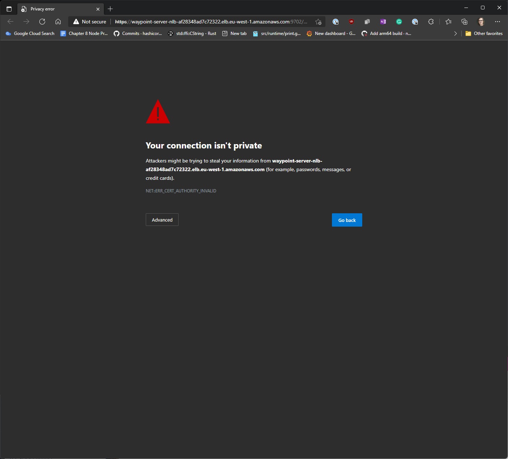
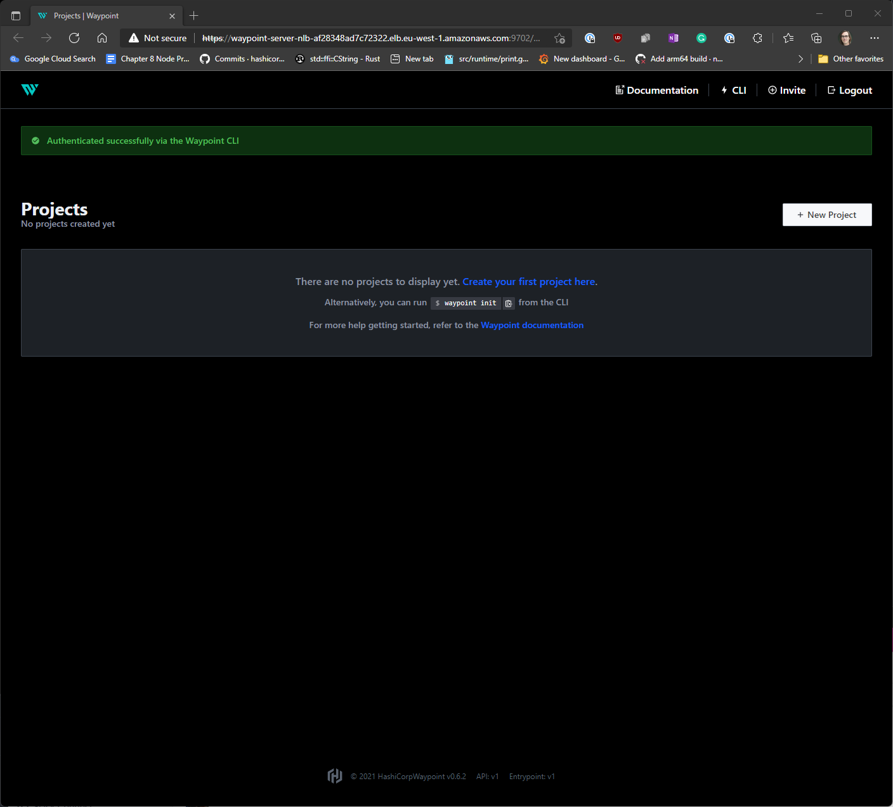
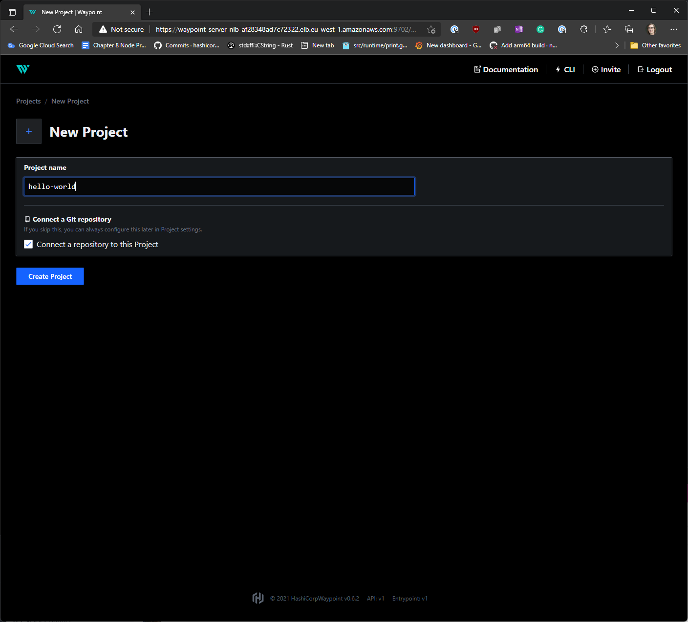
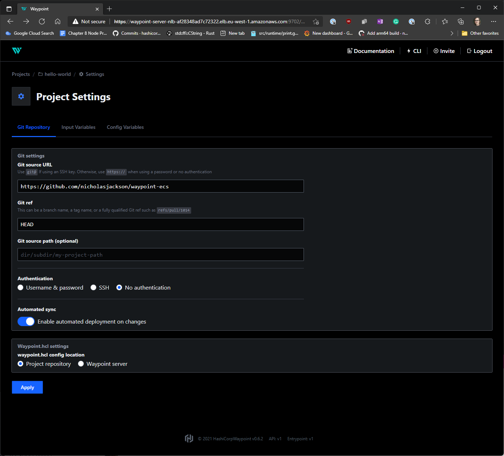

# ECS Waypoint Example

To run this example you need an AWS account with a existing VPC and ECR repository, or alternately you can use
the terraform code in the `./terraform/infra` folder to create a VPC and ECR repository.

## Installing Waypoint

To install Waypoint you can run the `waypoint server install` command. This will create the following resources
in your AWS account:

* ECS Fargate cluster
* ECS Task for Waypoint server and runner
* EFS file system
* IAM Roles for Waypoint server and runner
* Security groups
* ALB pointing to the Waypoint server

Normally you can leave the default values for the parameters and run the command, the only parameters that you 
need to supply are :

* -ecs-region=<the region you are deploying to>
* -ecs-subnets="<comma separated list of subnets in your vpc>"

The following is an example command for installing the Waypoint server showing some of the optional parameters that
can be used:

```shell
waypoint server install -accept-tos \
-platform=ecs \
-ecs-server-image=hashicorp/waypoint:0.6.1 \
-ecs-odr-image=hashicorp/waypoint-odr:0.6.1 \
-ecs-cluster=waypoint-server \
-ecs-cpu=512 \
-ecs-mem=1024 \
-ecs-execution-role-name=waypoint-server-execution-role \
-ecs-region=eu-west-1 \
-ecs-subnets="subnet-077d094531e3d76d1,subnet-047aa9f56d505fc5e"
```

It will take about 5 minutes for the server to be deployed and for the ALB to be created, once the server is running,
you will see a messge like the following: 

```shell
✓ Networking setup
✓ Created new ECS cluster: waypoint-server

# ...

The server has been configured to advertise the following address for
entrypoint communications. This must be a reachable address for all your
deployments. If this is incorrect, manually set it using the CLI command
"waypoint server config-set".

To launch and authenticate into the Web UI, run:
waypoint ui -authenticate

Advertise Address: waypoint-server-nlb-af28348ad7c72322.elb.eu-west-1.amazonaws.com:9701
Web UI Address: https://waypoint-server-nlb-af28348ad7c72322.elb.eu-west-1.amazonaws.com:9702
```

Now the server is installed you can configure a project to build.

## Configuring the project

First open the Waypoint UI and authenticate. You can use the following command to do this:

```shell
➜ waypoint ui -authenticate

» Creating invite token
This invite token will be exchanged for an authentication
token that your browser stores.

» Opening browser
```

A browser window will open and you may be presented with a message like the following.



By default Waypoint assigns a self signed certificate to the AWS load balancer, you can press the "Advanced" button and
then "proceed to this url".

You will now see the waypoint UI



To create a new project click the "Create Project" button.

First give the project a name, let's call it "hello-world"



Now let's connect the project to a GitHub repository, you can use this example repository:  

`https://github.com/nicholasjackson/waypoint-ecs`

Leave the `Git ref` and `Git source` as default  

And finally toggle the `Automated sync` button to on, enabling this feature will automatically build
and deploy your code every time you push to the repository.



## Creating a VPC and ECR repository with terraform

If you do not already have a VPC that you would like to use for your Waypoint deployment, you can use the bundled Terraform configuration
to create a VPC and ECR repository.


In the folder `./terraform/infra` run the following command to initialize the Terraform repository.

```shell
terraform init
```

```shell
Initializing modules...
Downloading cloudposse/ecr/aws 0.32.3 for ecr...
- ecr in .terraform/modules/ecr
Downloading cloudposse/label/null 0.25.0 for ecr.this...
- ecr.this in .terraform/modules/ecr.this
Downloading terraform-aws-modules/vpc/aws 3.11.0 for vpc...
- vpc in .terraform/modules/vpc

Initializing the backend...

Initializing provider plugins...
- Finding hashicorp/aws versions matching "~> 3.0, >= 3.1.0, >= 3.63.0"...
- Installing hashicorp/aws v3.68.0...
- Installed hashicorp/aws v3.68.0 (signed by HashiCorp)

Terraform has created a lock file .terraform.lock.hcl to record the provider
selections it made above. Include this file in your version control repository
so that Terraform can guarantee to make the same selections by default when
you run "terraform init" in the future.

Terraform has been successfully initialized!

You may now begin working with Terraform. Try running "terraform plan" to see
any changes that are required for your infrastructure. All Terraform commands
should now work.

If you ever set or change modules or backend configuration for Terraform,
rerun this command to reinitialize your working directory. If you forget, other
commands will detect it and remind you to do so if necessary.
```

Then run the `apply` command, Terraform will show you the resources it is about to create and ask you for confirmation.

```shell
terraform apply

Terraform used the selected providers to generate the following execution plan. Resource actions are indicated with the following symbols:
  + create

Terraform will perform the following actions:

  # module.ecr.aws_ecr_lifecycle_policy.name["hashicorp-dev-hello-world"] will be created
  + resource "aws_ecr_lifecycle_policy" "name" {
      + id          = (known after apply)
      + policy      = jsonencode(
            {
              + rules = [
                  + {
                      + action       = {
                          + type = "expire"
                        }

# ...

Plan: 21 to add, 0 to change, 0 to destroy.

Changes to Outputs:
  + ecr_repository = (known after apply)
  + ecs_subnet_1   = (known after apply)
  + ecs_subnet_2   = (known after apply)
  + ecs_subnet_3   = (known after apply)
  + vpc_id         = (known after apply)

Do you want to perform these actions?
  Terraform will perform the actions described above.
  Only 'yes' will be accepted to approve.

  Enter a value:
```

Enter `yes` when prompted, Terraform will then create the resources and you will see the following message when it is complete. The 
output variables listed by Terraform can be used for the Waypoint server install at the beginning of this README.

```
Apply complete! Resources: 21 added, 0 changed, 0 destroyed.

Outputs:

ecr_repository = "938765688536.dkr.ecr.eu-west-1.amazonaws.com/hashicorp-dev-hello-world"
ecs_subnet_1 = "subnet-077d094531e3d76d1"
ecs_subnet_2 = "subnet-047aa9f56d505fc5e"
ecs_subnet_3 = "subnet-021649c487f7b2091"
vpc_id = "vpc-0b925e97abfcece7a"
```